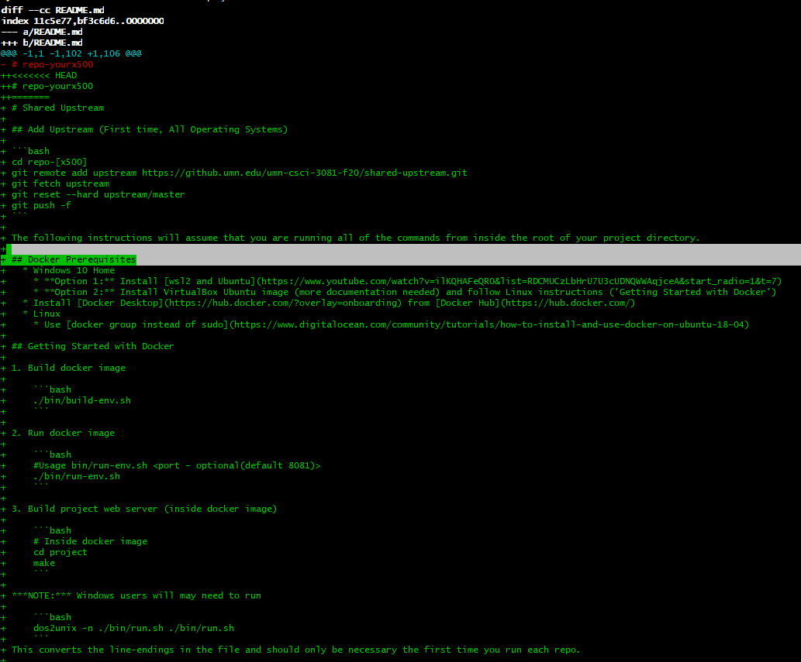

# 3081 Lab01 Git and Github Basics

## NOTE: Read the instructions in this lab carefully, or you may create a lot of pain and lost work for yourself later.

## What You Will Learn
1. Basic Linux commands, for example _mkdir_, _cd_, _mv_, and _ls_.
2. How to configure github for your cselabs account.
3. How to _clone_ (create a local copy of an existing repo), _pull_ (get
   updates), and _push_ (make updates).
4. How to configure the _.gitignore_ file so that _push_ ignores files not
   necessary to track.
5. The required directory structure and file nomenclature for course
   assignments.
6. How to initiate and read automated testing of course assignments.

For additional information about Linux, see
https://tutorials.ubuntu.com/tutorial/command-line-for-beginners#2 and/or
https://www.tutorialspoint.com/unix/index.htm

### Download Git [Windows Only]

You can download git [from here](https://git-scm.com/). Follow the onscreen instructions to install it wherever you wish.
Unless you are using WSL2 (see below), you should run all commands listed below inside of `git bash`. 
After installing git, you should be able to launch `git bash` like any other program, either creating a shortcut on your desktop/toolbar or opening it from your programs menu.

### Configuring GitHub

Below, a number of commands are shown that should be typed into the command
line. These are preceded by a dollar sign "$" which is NOT to be typed in.

Log into your cselabs account and verify that Git is configured.

    $ git --version

This will establish if it is installed.

    $ git config --global user.name "Your Name"
    $ git config --global user.email your_email@umn.edu

In order to use git, it has to know what to call you in its history. These commands set the configuration to know what identification to use. Note that your name appears between double quotes since it has spaces in it. Your email address does not have any spaces, so it doesn't need to be in quotes. [Note: If you use git for accounts other than your UMN account, you can remove the global tag (_--global_) to set the name and email for only this repository, but you must be within a git repo to do so.]

#### Configuring Your Editor [OPTIONAL]

If you forget to add a message to your commit or have a merge conflict, then Git will open its default editor and require you to enter text. You can configure which editor it opens (e.g. sublime, emacs, xemacs, vim, gedit, etc.) with the command below. We do not recommend Atom for this purpose.
```
$ git config --global core.editor "your editor choice here"
```

If you would like `nano` as your editor then you'll want double quotes around that 2 word phrase. 
For windows users, `nano` will *NOT* be available in the default command line, but will be preinstalled on git bash.
If you are using `nano`, all of the commands that say '^' should be entered using Ctrl. 
For instance, '^X' to exit is 'Ctrl-X'.
Also note that if you want to use gedit, you probably need to use `gedit -w -s` (gedit is not available on Windows by default).
Also also note that you should probably *not* use `atom`, because it has its own git plugin that does not usually play nice with command line git.

Use
```
$ git config --list
```
to see the various git configuration settings.

### csci3081-shared-upstream: The Read-Only 3081 Course Repository

Computer Science courses are setup for github by first establishing a GitHub
organization (e.g. _umn-csci-3081-f20_), as well as a read-only course repository (e.g. _shared-upstream_). Course materials will be distributed via the read-only repository, which will be merged into the master branch of your repository.

Open your browser and enter the following URL:

https://github.umn.edu/umn-csci-3081-f20/shared-upstream

Take some time and poke around in this repository, especially if you have never seen the GitHub interface before. 
If you have questions about the interface, search for answers online. 
DuckDuckGo, Google and other search engines will be your friend during this class.
In particular, StackOverflow is a great resource - be careful that not all answers on the site are perfect though.

### Creating your Personal 3081 Repository

This can be done in two ways. If you'd like to create the repository on your own in command line, you are free to do so. The TAs may be able to help. These instructions will show the steps for the other method: creating the repository through the Github interface.

1. Navigate to the umn-csci-3081-f20 (https://github.umn.edu/orgs/umn-csci-3081-f20) organization page.

2. Click on the green button on the right that says 'New'.

3. Under _repository name_, you **MUST** follow the naming convention specified in the next sentence so the automated grading scripts can properly identify and grade your work. Specifically name your repository: repo-&lt;student-umnid&gt; where &lt;student-umnid&gt; is *your* x.500 id. For example, if your UMN x.500 id is doexx123, then your repository should be named repo-doexx123.

4. **IMPORTANT**: select _private_ as the privacy setting. If you leave it as public, any other student can also see your repository (and potentially push code, delete code, etc.).

5. Select the checkbox to 'Initialize this repository with a README'. It is not necessary to specify .gitignore extensions.

6. When you select 'Create repository', your personal repository will be created on the github.umn.edu server and you will be navigated to your new repo.

Now that your repo exists on the remote server (that is, **github.umn.edu**), so you will want to clone it into your local repository of your cselabs account. 

We strongly recommend that you do **NOT** follow the instructions listed in this new repo. We will be doing something that is slightly different from how the typical repository would be built.

7. Under 'Clone or download', ensure that HTTPS is selected and click on the copy icon on the far right. This will copy the repository reference to the clipboard. We will refer to this as the **_&lt;clone-ref&gt;_**. Now, you can clone this repo from the remote Github instance to your local workspace (on the CSELabs machine you are working on).

### Cloning Your Personal Repository

Go back to your terminal. At the top level of your cselabs account or within a subdirectory of your choice, create a 3081 directory with any name you prefer, then move to that directory. Then clone your individual repo into this
directory. Replace **_&lt;clone-ref&gt;_** below with the repository reference we copied earlier (i.e. paste, typically Shift+Insert in a terminal).

    $ (optional) cd <location of your choosing>
    $ mkdir 3081_f20
    $ cd 3081_f20
    $ git clone <clone-ref>
    $ ls

**_What just happened?_** You made a new directory (i.e. folder) in your account
with `mkdir`. You changed that to your working directory with `cd`. You copied
the repo locally to your machine with `clone`. You listed the contents of
the working directory with `ls`, which should list the newly created directory
with the name of the repository which it contains. These directories function
exactly like all other linux directories. There are hidden files that track
changes to the repository.


### Setting a Second Remote: Getting the support-code

What we want to be able to do, as instructors, is to publish code and other materials to aid you in your work throughout the semester. To do that most efficiently, and give you some Git practice along the way, we will be publishing updates to the shared-upstream repository. The next step then is getting those changes and materials into your own repository.

What you will do is add a second remote target to your local repository. This means that you can pull from two different repositories into your local repo (note: you can only push to your own remote repo; we'll prevent you from pushing to the shared-upstream).

You should be in your personal repo directory. Look at the path:
```
$ pwd
```
to confirm that you are in the directory repo-&lt;student-umnid&gt;.

```
$ git remote add upstream https://github.umn.edu/umn-csci-3081-f20/shared-upstream.git
```

> Note: If you get an error saying that the remote already exists, you can remove it and add again with the command `% git remote rm upstream`.


Type the following command to see which remote repositories are associated with this repository:
```
$ git remote -v
```
**_What just happened?_** You added a remote target to the local repository, which can now be referred to as _upstream_. This will allow you to pull the branch _support-code_ from the shared-upstream repository. Then, to verify it worked, you listed the remote targets that are currently available. You should see two sets of two: a fetch and push for origin (your repo) and a fetch and push for the shared-upstream repo.

Now, let's add the _support-code_ branch to your local repository before getting what you need from shared-upstream.

    $ git checkout -b support-code

**_What just happened?_** You did two things at once. First, you created a new local branch, called support-code. Second, you switched the branch you are in to the support-code branch. We'll show the difference in a moment.

You are now in the support-code branch. Branches are useful for keeping _sets_ or _versions_ of your codebase separate. This is commonly used to separate good, style-compliant, error-free working production code (_master_) from development versions (_develop_) and versions that individual developers are working on to fix a bug or add a feature (e.g., bug_34_typos_everywhere).

You can see the difference in the branches by switching between them, using the git checkout &gt;branch_name&lt; command.
```
$ git checkout master
$ ls
$ git checkout support-code
$ ls
$ git checkout master
```

NOTE that we are NOT using the `-b` flag. This is used only when you want to create a new branch.

Now, get the student support code by _pulling_ from the _support-code_ branch of the shared-upstream repository.

```
$ git pull upstream support-code --allow-unrelated-histories
$ ls
```
**_What just happened?_** You downloaded the contents of the shared-upstream branch into your local support-code branch. Listing the contents of the current directory now shows the existence of the labs/ directory. Within that directory is Lab01_Git_Basics/ and within that subdirectory are the files main.cpp, makefile, and README.md (which is the same file you're reading right now, except now there is a copy on your machine).

#### Resolving Merge Conflicts

You may have received an error message saying something like `Automatic merge failed; fix conflicts and commit the results`.
If you did not receive this message, you don't need to enter this section, but you definitely need to understand the process here - it will come probably come up many times in your project this semester.
Broadly speaking, this means that, when downloading the new code, the program ran in to duplicate versions of some files. 
It needs you to tell it how to combine the changes it found in each version.

This process is called **merging**.
If you read the error message, **which you should get used to doing**, you'll notice that the problem is with README.md.
We can look at the merge errors in file <file_name> using the following command:

```
$ git diff <file_name>
```
After calling `git diff` on `README.md`, you'll probably see something like this 



The stuff in between `<<<HEAD` and `======` represents the version of the file that you have on your local machine.
the stuff after `=====` (terminated by a  `>>>>>` that becomes visible if you scroll down) shows the version of the file that we got from the online repository.
Our job is to choose which of these two versions we want.
In this case, we'd like to keep the first line of our file and everything else from the online version.

Here, you have a couple of choices:

##### 1. Checkout the online version and edit that
To choose to keep the online version of the file, you can issue the following command 

```
git checkout --theirs <file_name>
```
Here, file_name is just README.md. Note that you will need to include the path if the file you want is not in the home folder.
If you had wanted to keep your version of the file, you could have used the option `--ours` instead of `--theirs`.

However, we still want to make sure that the first line has our repository name, so you'll need to go in to the file and change the first line to say `#repo-<your_x500_here>`.

###### OR 2. Edit the file manually

To resolve the conflict manually, you can open the file in your choice of text editor and edit it manually.
To resolve the conflicts, you need to make sure that you get rid of the `<<<<`, `>>>>` and `====` lines. 
Keep the parts that you need in between.
In this case, we want to keep the part in between `<<<<` and `====` because that has the name of our repository.
Besides that, we also want to keep everything between `====` and `>>>>` besides the first line, which has the name of the repository that we pulled from.

>Note: Whenever you merge, make sure that you are in the branch that you want to merge _into_. And it is a very good idea to ALWAYS push any changes before merging. If there are differences in these branches that Git does not know how to combine or there is code that did not get pushed before the merge, you will get a _merge conflict_.

### Pushing Results

In the next part of this lab, you will setup the _.gitignore_ file so that the former file is not added to the repo, but the latter is.

Before telling git what not to track, look at what it has been tracking.

    $ git status

You will see the directories and files that have been added to this repository.

### Configuring and Using _.gitignore_

There are a lot of files that should not be tracked in the repository. You
typically don't want object and executable files included in your repo, because
these are consequences of the local compilation. There are common files or
libraries that should not be included, because:

1. It is wasteful to have multiple copies and to spend bandwidth moving them
   around.
2. There might also be files that are for you only, such as notes about the
   project or todo lists.

3. Such files may be capable of running only on the machine that you are
   currently on, and if you move to another machine and try to run them you
   might get very strange errors/behavior. Better to avoid this altogether.

The _.gitignore_ file stores file extensions that serve as a filter for git. Any
file with that extension will not be tracked.

*HOWEVER*, if you add a file to a _.gitignore_ and that file is already checked
into your repo, changes to the _.gitignore_ to ignore that file have no effect;
it only applies to FUTURE checkins to the repository.

If you are still in the Lab01 directory, using your favorite text editor, create a .gitignore file (e.g., `nano .gitignore`, which will open `nano` in a new window. Edit the .gitignore file to remove your executable.

Add these lines to the file:

    # Extensions to not include in repo
    *.o
    *.out
    *.pvt

Save the file.

**_What just happened?_** You added a comment by prefacing the first line with
`#`. You indicated to not track any and all files with the use of `*` that has a
specific file extension (e.g. `*.o`). If you have a one-off, you can include
that specific file. You can also add a directory name, which will ignore all
contents of the directory.

Look at the results:

    $ git status

Now you will see that the indicated files in _.gitignore_ are no longer
considered to be untracked, and are simply ignored.

### Add Changes to Repo Both Locally and On the Server

You need to _stage_ all changes to the repository, which prepares those items to
be permanently part of the repository. When you _commit_ those changes, they are
saved to your local repository, which lives in your cselabs account (or your
personal computer if that is what you are working on). When you _push_ those
changes, they will be copied to the repo on the server. The difference between
_commit_ and _push_ is what separates git from centralized version control
systems. 

Currently, all of your changes have been on your local `support-code` branch. However, your remote repo doesn't have a `support-code` branch. Inspect the error message that pops up after running these commands:

    $ git add -A
    $ git commit -m "add(lab01): Adding lab01 results."
    $ git push

Push your `support-code` branch using the command in the error message. Throughout the semester make sure you submit your assignments in the correct remote branch that we specify using `git merge` and `git push`.

## **We will be grading your remote `support-code` branch for labs 1 and 2**  

**_What just happened?_** All of the tracked changes were staged with `git add
-A`. You could have only staged certain files by replacing _-A_ with the
filename. Note that `add` does not mean you are adding a new file or a new
directory, it means you are adding a change (any change). Those staged changes
were committed to your local repository and tagged with the message that follows
`-m`, then pushed to the server.

**GET USED TO THIS PROCESS** Throughout this project, you will be using these commands a lot. In general, you want to use them in this order

    $ git pull
    $ git add -A
    $ git commit -m "<your_commit_message_here>"
    $ git push
    
This set of commands will update your repository with any changes that are found online and then send your changes to the server.

>Always use meaningful and readable comments in the commit. If you need to restore a previous state of the repo that is several commits back, you will have a much easier time figuring out which commit is relevant when you use comments like _"adding class definition for a bus"_, as opposed to _"more class stuff"_.

>Always verify that your changes have been uploaded to the github server (**github.umn.edu**) by looking at the repo through the web interface of github.

### Reading the Feedback

Pushing to the server triggers the automated grading system. Soon your repo will
contain a feedback file, letting you know if you have passed all tests of the
assignment. These tests will make sure you have the right directory structure,
filenames, and that everything is behaving as indicated in the requirements.

Watch your github account via the web interface to see when the feedback file is
ready (hit refresh to check contents). You can look at it through the web, but
it is important to pull in that file to your local repo, so as not to cause
merge conflicts.

    $ git pull
    $ ls

> ALWAYS, ALWAYS, ALWAYS perform a _pull_ before making changes to a repository. Each time you sit down to work on a lab or project iteration, perform a _pull_ of the support code  - It is an excellent idea to make a habit of this practice.

If you are satisfied with the grade reported on the feedback file, then you are done. If not, you are welcome to make corrections and push any changes. Every time you push, a new feedback file will be generated for this lab to let you know how you did.

THIS LAB IS COMPLETE.

Congratulations on completing your first Csci 3081 lab!

### Optional

If you're so inclined, you can set-up ssh-keys to avoid retyping your password.
Instructions for how to do this can be found [here](https://stackoverflow.com/questions/8588768/how-do-i-avoid-the-specification-of-the-username-and-password-at-every-git-push) or [here](https://docs.github.com/en/github/using-git/why-is-git-always-asking-for-my-password).

