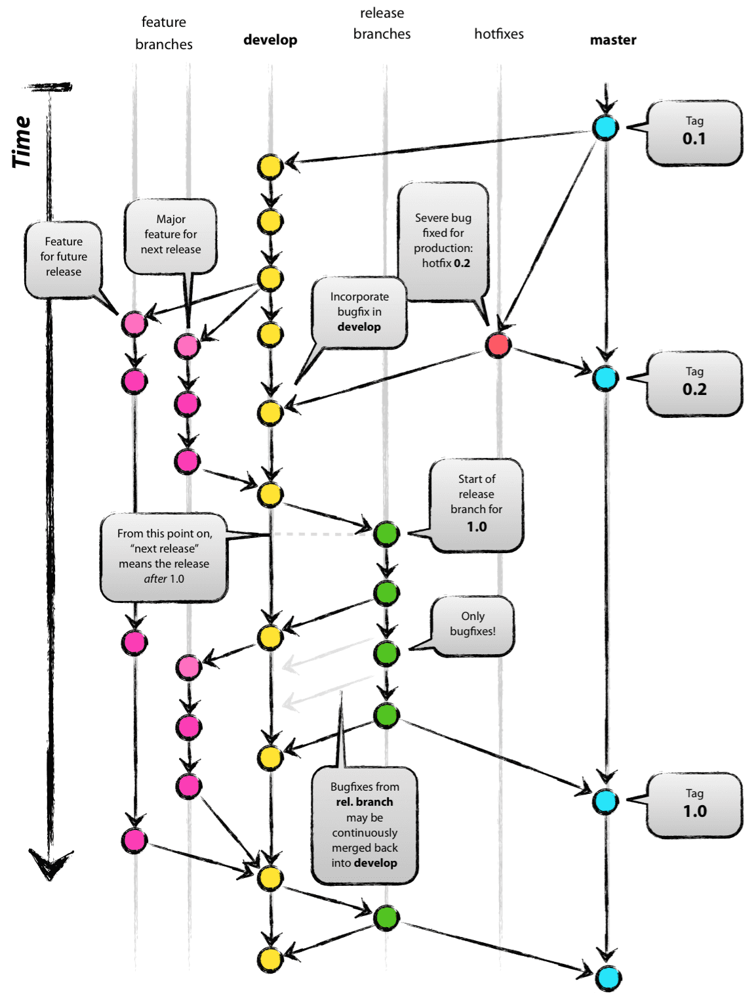
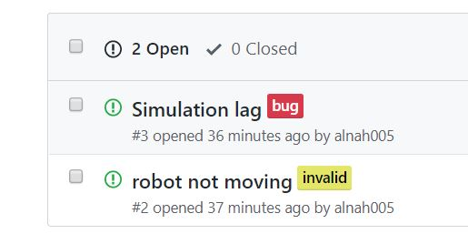

# Lab 13 : The Process of using Git for Team Development of the Project: Merging, Branching, and GitHub Issues

### Table of contents:

  1. [Summary](#summary)

  2. [Introduction to team repo](#intro)

  3. [Setting up team repo](#setup)

      1. [Renaming `master`](#rename)

  4. [Branching philosophy for iteration2](#branches)
  
  5. [GitHub Issues](#issues)

      1. [Creating a GitHub Issue](#create_issue)

      2. [Create feature branch to address Issue](#feature_branch)

      3. [Commit messages](#commit_messages)

  6. [Submit a pull request](#pull_request)

  7. [**IMPORTANT** Note about individual grades and **academic honesty**](#individual_grades)

  8. [Copying Iteration1 Solution](#iter1)

<a name=summary></a>

# Lab Summary

In this lab you will be introduced to your team git repository for iteration2 and learn about how use github to develop code as a team. You will be able to do a portion of the lab alone, and a portion should be done after some discussion with your partners.

For the solo portion of the lab you will create an issue, make a feature branch to solve the issue, then merge that feature branch back into `devel` using a _pull request_.

For the portion that should include some communication with your group, you will be copying a working iteration1 solution into your team repo. You need to correspond with your team and determine what iteration1 solution you would like to use.

## Git usage document

There is an informative guide on the use of git and branching that was developed by John Harwell, a former teaching assistant for this course. Please review this because, as part of project assessment, we will be looking at your use of _issues_, branching, and commit messages. This guide can be found in **_git-usage.pdf_** in the lab13_git_for_Team_Development folder.

<a name=intro></a>

# Introduction to team repo

For iteration2 you have been added to a team which includes your group members as well as a repo for you to work in. The repo is named `repo-iter2-<section_number>-<team_number>` where section number is either 10 or 20, and team number has a leading 0 if your team number is a single digit.

<a name=setup></a>

## Setting up your team repo

To set up the repo we want to:
 - Rename `master` to `release`, and create `devel` and `feedback`.
 - Add `shared-upstream` as a remote.
 - Pull `shared-upstream` to `devel`.
 - Set some options for `devel` and `release`.

If it looks like your repo has already been set up by a teammate, please look through these directions to ensure that everything is correct. If you get stuck on a step please let a TA know.

We are going to be working with mostly just `release` and `devel` branches to start with, though more branches will be made as your group works on the project. `feedback` will be where feedback from tests and the like are pushed.

<a name=rename></a>

## Renaming `master`

To start with, rename `master` to `release` (since `master` is normally used like how we use `release`)

Here are the directions to do so if you are renaming to `main`, with useful pictures. I'll summarize it here for convenience, and replacing `main` with `release`.

https://jarv.is/notes/github-rename-master/

### `move` your branch to `release` with

```
git branch -m master release
```

### Push the new branch to Git

```
git push -u origin release
git remote set-head origin release
```

### Change default branch to `release`

Follow directions in link, this step is done in the browser.

### Delete `master`

```
git push origin --delete master
```

### Done with this step! No need for the final step in the linked article since this is a fresh repo.

## Create the `release` and `devel` branches

Next just create the 2 other branches you need `feedback` and `devel`. If you do not remember how to do this refer to previous labs or use google.

## Set `shared-upstream` as remote.

To do so, follow the instructions from lab 1. Then pull the shared upstream into `release`

## Finally set some options in `release` and `devel`

Open the repo in your browser, select options in the top right and then branches on the menu that appears on the left.

We want to require _pull requests_ to be reviewed by teammates before they are integrated into your branches.

Click "Add rule" to add a branch rule. Then type the name `release` as the name pattern, and select "require pull request reviews before merging". Set the number required to 2 for `release`. Then do the same thing for `devel`, but this time set the number required to 1.

# Done with setup!

<a name=branches></a>

# Branching philosophy for iteration2

When working in a team, it's important to follow similar workflows so everything can run smoothly with no conflicts. Here we will outline the roles of the `release` and `devel` branches.

- `release`: We are using the `release` branch analagously to how most other projects use their `master` branch. <b>ONLY</b> working code should be merged to the `release` branch. If you push something that is broken the day before the iteration is due you will not have any fun restoring your codebase to a working condition with an impending deadline.

- `devel`: Devel should ALSO ONLY HAVE WORKING CODE. It will be used as the base branch for _feature_ branches, which are introduced in a moment. If you break `devel` and it no longer compiles, you will hinder the rest of your team until you fix the bug. The general workflow should be: create feature branch from `devel`, add feature/fix bug, merge feature branch into `devel`. As such, you shouldn't be working/committing directly to `devel` at all.

- Feature branches: This is where you actually work on code. When you identify something that needs to be worked on (likely from a GitHub issue, introduced later), you should create a feature branch with a specifically formatted name. This branch should be created from `devel`, so that you have a working version of all the features implemented so far. After completing the work that the feature branch was created for, you merge the feature branch back into `devel` so others now have access to the newly implemented feature.

### Feature branch naming format:

```bash
<issue_label>/<issue_number>-descriptive-title
```

When you create your first issue below, you'll learn how to label it. When creating a feature branch you should use the above format where <issue_label> is replaced with the label of the issue the feature branch addresses. Additionally, each issue will have a number, which you should use in place of <issue_number>. Then the rest of the feature branch name is a descriptive title, separated with dashes.

Here is a diagram depicting the branching philosophy visually. In our case, the far right blue branch is our `release` (`master` for them) branch, yellow is our `devel` branch, and pink are our Feature branches.

<p align="center">  </p>

The following are git resources for you to reference. The first resource lets you see a graphical representation of a git sandbox where you can model the workflow outlined above. The second link is a commonly referenced git branching philosophy resource which has been linked in at least one previous lab. The diagram above is also from that link. Feel free to check out either in more depth if you feel so inclined.

https://learngitbranching.js.org/

http://nvie.com/posts/a-successful-git-branching-model

<a name=issues></a>

# GitHub Issues


As you develop your code, you will encounter a range of modifications that need to be made to the code, whether you are adding functionality, fixing it, or refactoring. More specifically, you might categorize the needed modifications as such:

| Category | Description |
|----------|-------------|
| Feature | An actual feature (i.e. adding new functionality to the code).
| Refactor | Refactoring existing code. Does not change behavior.
| Bug Fix | Fix a bug that was found in the code.
| Style | Updating/fixing code style (i.e. making it Google style compliant, for example).
| Doc | Adding/updating documentation for the code.
| Chore | Doing miscellaneous grunt work, such as file moving, renaming, etc.

You can mainly use the default labels if you wish, but you need to at least add the label `core`. This is specified [here](#individual_grades)

Github provides a convenient and integrated method for keeping track of the needed modifications using **_Issues_**. As part of the development requirements of iteration1, we expect that you will be using these Github issues to track bugs, keep a list of feature enhancements, and needed refactorization.

Below is an example using issues to track bugs in a project:

<p align="center">  </p>

**The process of significant code modification should start with the creation of an issue that has an appropriate label attached to it** (in the example above, the label "bug" was used). The next step is to create a branch in which to address the issue.

> Note that you should probably only make one branch at a time so that you aren't trying to merge multiple branches into one. Create as many issues as is needed to track everything, but try to address only 1 at a time.

<a name=create_issue></a>

# Creating your first GitHub Issue

The first deliverable of this lab is the creation, assignment, and resolution of your repo's first few issues.

## Create your issue

To walk through the process we will create a simple issue. In this case, you must add your x500 to the README in your repository. Create your issue by using the GitHub browser. Click on the `Issues` tab next to the code tab near the top of the website. Then click the green `New Issue` button. Next type a descriptive title and description. Before you submit your issue, Label it with the Labels option on the right, you can choose whatever label you think it appropriate. Then use the Assignees tab on the right to assign yourself the issue.

<a name=feature_branch></a>

## Create and push a feature branch to address your issue

Create a branch **with the specified name format**. **Remember** it should be branched off `devel`. Add your change, then review the below commit message guidance.

<a name="commit_messages"></a>

## Commit Messages

Refer to the _git usage_ pdf in the `shared-upstream` repo, which is a document put together by John Harwell, a former TA for this course.

As part of good documentation, it is important to record how the code was modified from the last commit. The git usage document outlines a template and offers a few examples. When making a substantial commit, you need to **NOT** use the `-m` flag so that your configured editor opens for you to edit. This allows you to add more detail than you would be able to with the `-m` flag.

>The default editor is vim. If you want another editor, see the git usage document for how to change that.
>Make sure to let your TA know if you reach a dead end.

When you do this, you will notice a series of lines preceded by \# that include very useful information about the status of your repo. A little further down in the document there are directions on how to take the template in the git usage document and add that to the text that appears when your editor opens.

Now you want to add the short message at the top, as well as some more extensive comments underneath that.

```text
fix(files): fix #1 <short description of commit>

- Multiple lines of description
- Lists all the important elements that have been changed
- etc.
```

The template provided in the git usage document can be added to git so that when the editor opens, you will see that content. To add the template, save the text preceded by '#' in the pdf as a file (_~/.gitmessage_ is the convention) and add to your git configuration:

```bash
git config --global commit.template ~/.gitmessage
```

The general style is to list the type of modification, in parentheses list the impacted files, then provide a short description of the change. The lines that follow provide specifics. Notice the \#1 in the message. When you use the issue number in the message, Github recognizes and adds the commit message as a comment to the issue creating a link between the issue and any related commits and branches. More on this [here](https://help.github.com/articles/closing-issues-using-keywords/).

## Commit your change

Decide on a reasonable commit message and commit your change. Also push your new branch at this point. (Refer to previous labs or google if you don't remember the exact command. Being able to look up tool usage is an important skill.)

<a name="pull_request"></a>

## Submit pull request

Once your branch is pushed, you want to merge it with `devel`. To do this formally, you submit a _pull request_. A _pull request_ is a _request_ that the repo _pulls_ the changes from a branch you modified to a branch that you specify. You can do this from the Github interface under Pull Requests. Then a team member can _accept_ the pull request to merge the branches. **Make sure your pull request is into the _devel_ branch - select from the pulldown menus.** If there are currently pull requests waiting acceptance, you should review those and make sure they add their x500 to the readme. If they look good go ahead and accept them. You can consider yourself to be done with the solo portion of the lab when there are no waiting pull requests, and you have submitted your own pull request.

Go to Github and look at the Issues. Close any issues that have been fixed by clicking on the _Close issue_ button at the bottom.

We would normally suggest that you delete the branch, but then we won't be able to see your history of using branches. **DO NOT DELETE YOUR BRANCHES!!!**.

<a name=individual_grades></a>

# IMPORTANT: a note on individual grades and academic honesty

For this course, you have an individual grade on top of your group project grade. These individual grades are determined by how the core tasks of your project were distributed, and who worked on each one. Therefore you **MUST** add the label `core` to issues that we specify as core to the project (which will be in the specifications for iteration2). Only **one** persion should be assigned to each `core` task. Completing work on a `core` task that you are not assigned to without documenting it is like doing someone else's homework. However we want you to still be able to work together, since peer programming is a very useful skill. Therefore when you work with someone on a `core` task, that work should be documented with the following format:

Create a file named: `<core-task-name>-groupwork.txt`

Whenever you work together add:
 - The date.
 - Who you worked with.
 - What you needed help with. (2-3 sentences)

Then that file should be uploaded when you complete the `core` task. If you need to go back and fix or restructure something relating to that task, the person who was originally responsible for the task should do so, and update the document if necessary.

We encourage you to work together, we just need to make sure that everyone is contributing. Thanks!

<a name=iter1></a>

# Copying Iteration1

For this step, **first contact your groupmates!** Together you need to decide what iteration1 solution you want to use. For the purposes of beginning on Iteration 2, you need a solution to Iteration 1 that _passes all the assessment tests_. So copy a solution that meets that criteria if you have one, otherwise you will need to choose which one to copy and work as a team to fix the bugs.

After Monday, the Iteration 1 Assessment tests will run on your team-repo whenver you push to your repo-x500 lab13 directory. Once your solution in your team repo passes all those tests, you are ready for iteration2!

## Parting Thoughts

Keep in mind that GitHub Issues are there to remind you what needs doing and fixing. This means that you use it like a todo list, writing things down as they occur to you.

It probably took you awhile in this lab to add the issue, make the branch, then merge it back into devel after the changes were made. This will go very quickly once you get in the habit, and we think you will eventually appreciate the documentation of the changes that have been made and the ones that still need to be made.

If you are addressing anything substantial, follow this full process of issues and branching (and it might involve multiple issues and branches). But you don't have to do this _every_ time you make a change! If you have something minor (like fixing a typo) -- skip making an issue, make the change in the devel branch, and use the command line for commit messages. The important part is to be consistent.

# Note on feedback regeneration

To trigger a feedback regeneration for this lab, you must modify a (any) file in `labs/lab13_git_for_teamwork`.

The feedback server looks for changes in that folder and only regenerates if something within it has changed. Since the work for this lab will be done in a different repo, it will not regenerate automatically.

I would recommend that you just make a trivial change to the this file (e.g. add a word) to trigger the feedback regeneration!
